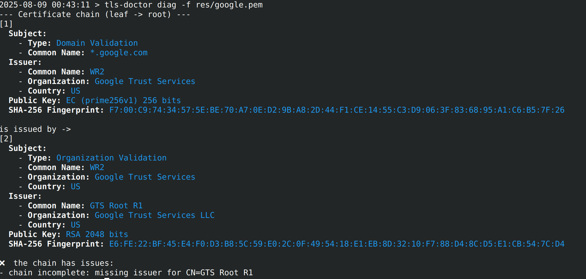
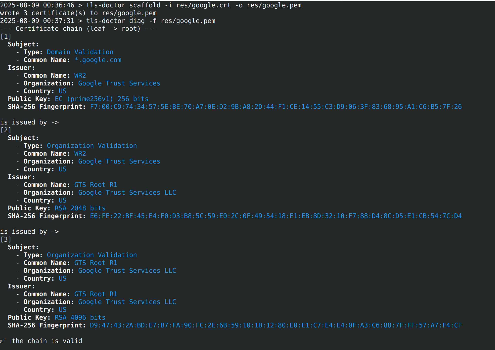

# tls-doctor

A Rust CLI to inspect TLS certificates and chains, with two subcommands:

- **diag**: diagnose a live server or a PEM bundle and validate the chain
- **scaffold**: build a full bundle from a leaf certificate file by fetching intermediates via AIA


## Installation

```bash
cargo install --path .
```

## Build & test

```bash
# Build
cargo build

# Run unit tests
cargo test

# Run locally without installing
cargo run -- diag -s google.com -p 443
```

## CLI usage

### diag subcommand

```bash
tls-doctor diag -h
Diagnose a live server or a PEM bundle

Usage: tls-doctor diag [OPTIONS] <--server <SERVER>|--file <FILE>>

Options:
  -s, --server <SERVER>  Domain name or IP of the server to connect to
  -f, --file <FILE>      PEM bundle file (one or more concatenated certificates)
  -p, --port <PORT>      Port of the server (default: 443) [default: 443]
      --insecure         Disable certificate verification (like -verify 0). Useful for inspecting invalid chains
  -h, --help             Print help
```
\



### scaffold subcommand

```bash
tls-doctor scaffold -h
Scaffold a complete bundle from a leaf certificate file

Usage: tls-doctor scaffold --input <INPUT> --output <OUTPUT>

Options:
  -i, --input <INPUT>    Input leaf certificate file (PEM or DER)
  -o, --output <OUTPUT>  Output bundle destination (PEM); will be created/overwritten
  -h, --help             Print help
```
\


## How it works

- diag (server):
	- Opens a TLS connection to the host:port and collects the peer certificate and any provided intermediates.
	- Orders the chain leaf → root (best effort), prints concise details for each certificate, and validates the chain against the OS trust store (OpenSSL default paths).
	- Prints a summary: valid or issues with short explanations.

- diag (file):
	- Reads a PEM bundle, orders the chain, prints unrelated certs (if any), and performs the same validation against the OS trust store.

- scaffold:
	- Parses the input leaf certificate (PEM or DER).
	- Extracts AIA caIssuers URIs from the certificate and iteratively fetches issuer certificates over HTTP(S).
	- Accepts DER or PEM issuer responses (best effort), stops at a self-issued cert or when AIA data is missing.
	- Writes the collected chain to the output PEM file (leaf first).
	- Note: Roots are not “downloaded”; anchoring is expected to come from the system trust store when validating.

## Troubleshooting

- TLS handshake fails (diag server):
	- Check host/port, firewall, and SNI correctness (use the DNS name you expect the cert for).
	- If the server presents an invalid chain, add `--insecure` to still inspect it.

- “chain incomplete” or “unrelated certificate(s)” (diag file):
	- The input bundle likely mixes unrelated certs or is missing an intermediate. The tool orders what it can and reports extras separately.

- Validation fails but the chain looks correct:
	- Your OS trust store may not include the issuing root (corporate/private PKI). Install the CA at the OS level, or use `--insecure` for inspection only.

- scaffold finds no intermediates:
	- The leaf or its issuer may not include AIA caIssuers URIs (not mandatory). You may have to add intermediates manually.

- scaffold fetch errors/timeouts:
	- Check network connectivity and proxies. The HTTP client honors standard env vars like `HTTP_PROXY`/`HTTPS_PROXY`.
	- Some AIA endpoints can rate-limit or be temporarily unavailable; retry later.

- scaffold output is missing the root certificate:
	- By design, roots are not fetched online. Verification is expected to trust a system-installed root.

- Input format issues:
	- The tool accepts PEM or DER for the leaf and for fetched issuers. If an AIA endpoint serves PKCS#7 bundles, extracting certificates manually may be required.

Output includes for each certificate:

- Subject and Issuer
- Public Key algorithm and size
- SHA-256 fingerprint
